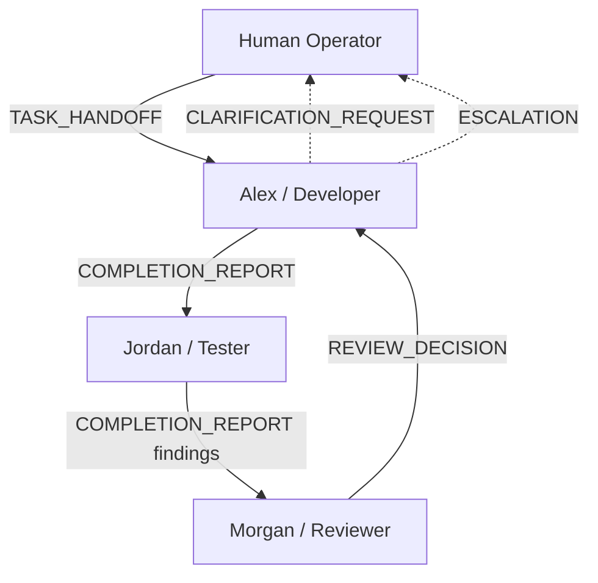

# AgentMesh — Project Overview

## One-line Positioning

AgentMesh is an **AI Organization Simulator** — a system of human-like digital coworkers that collaborate **purely through natural-language messages**, the way colleagues do inside a real company. It is **not** a traditional multi-agent orchestration or tool-calling framework.

## Core Thesis

> **Better coordination = smarter outcomes**, independent of model size.

Instead of assuming `bigger model = smarter`, AgentMesh explores whether a small organization of specialized agents — each with personality, memory, and autonomy — can outperform a single super-agent. The lever we pull is **coordination quality**, not parameter count.

## What Makes It Different

- Agents do **not** call each other as tools or functions. They send each other natural-language messages.
- Knowledge travels through **communication**, not through shared memory. Each agent has an isolated memory store that no other agent can read.
- Every interaction is an **ACP (Agent Communication Protocol) message** with a typed intent (e.g. `TASK_HANDOFF`, `COMPLETION_REPORT`, `REVIEW_DECISION`) and a free-form natural-language body.

## Target Users

- Engineers who want to study agent coordination, message-driven architectures, and emergent collaboration.
- Builders curious whether structured communication can substitute for scale.
- Small teams who want auditable, observable multi-agent collaboration on a local machine.

## MVP: Three Digital Coworkers

| Agent | Persona | Responsibility |
|---|---|---|
| **Alex** (Developer) | Pragmatic, detail-oriented | Implement, plan, hand off |
| **Jordan** (Tester) | Skeptical, meticulous | Test, surface edge cases |
| **Morgan** (Reviewer) | Senior, high-standards | Synthesize, decide, enforce quality |

## Collaboration Flow

All arrows are **natural-language messages** flowing through a shared message bus. No agent invokes another agent's code.

## Project Boundaries

### In scope
- Agent profiles (personality, working style, specialization) loaded from YAML.
- A SQLite-backed message bus carrying typed ACP messages.
- Isolated per-agent memory (short-term + long-term) with cross-agent read protection.
- An agent state machine (`IDLE → READING → PLANNING → EXECUTING → REPORTING → WAITING`).
- A CLI to load agents, inspect status, inject human messages, and watch the live message stream.

### Not prioritized (for now)
- A full web frontend.
- Enterprise authn/authz.
- Kubernetes / distributed scheduling.
- A self-built vector database.

## Design Principles

1. **Communication over invocation** — agents coordinate by messaging, never by calling each other.
2. **Memory isolation** — knowledge spreads only through messages; reading another agent's memory raises an error.
3. **Typed intent, free-form body** — every message has a `MessageType` plus a natural-language body.
4. **Observable by default** — every message and state change is persisted and streamable via `agentmesh watch`.
5. **Swappable backends** — LLM provider and worker are abstracted behind config (`anthropic` / `mock`).

## MVP Success Criteria

- At least three agent roles: developer, tester, reviewer.
- A working message bus with publish / poll / consume / thread retrieval.
- Isolated memory that rejects cross-agent reads.
- A validated agent state machine that rejects illegal transitions.
- A CLI that can load a profile, show status, inject a message, and stream the feed.
