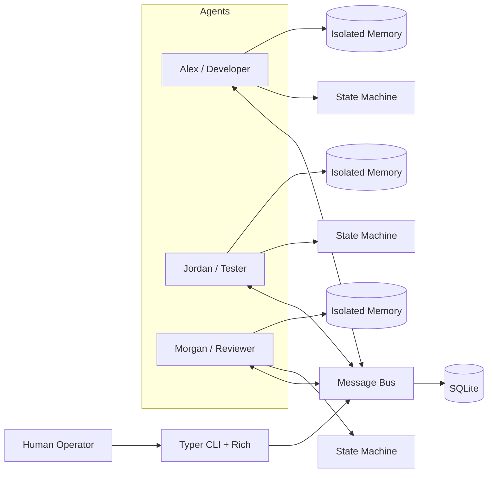
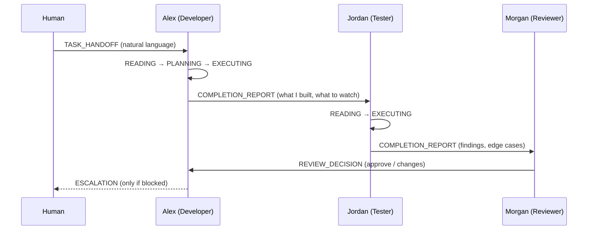

# AgentMesh — Technical Architecture

## 1. High-level Architecture



The central nervous system is the **message bus**. Agents never call each other directly — they publish and poll ACP messages. Each agent owns a private memory store and a private state machine.

## 2. Core Modules

| Module | Path | Responsibility |
|---|---|---|
| Models | `agentmesh/models/` | `AgentProfile` schema and `ACPMessage` / `MessageType` types |
| Database | `agentmesh/db/` | SQLite connection + schema (`messages`, `agent_memory`, `agent_states`, `tasks`, `events`) |
| Message Bus | `agentmesh/bus/` | All inter-agent communication: publish / poll / consume / get_thread |
| Memory | `agentmesh/memory/` | Isolated per-agent memory with cross-agent read protection |
| Runtime | `agentmesh/runtime/` | Agent state machine and valid-transition enforcement |
| CLI | `agentmesh/cli.py` | Typer entry point: agent load / status / message, watch |
| Profiles | `agents/` | YAML profiles for Alex, Jordan, Morgan |

### 2.1 Models

- **`AgentProfile`** — `name`, `role` (`developer` / `tester` / `reviewer`), `personality`, `working_style`, `specialization`, `llm_backend`, `worker`. Personality and working style are natural-language strings that shape how the agent behaves.
- **`ACPMessage`** — `id`, `thread_id`, `sender_id`, `recipient_id`, `message_type`, `body` (natural-language), `metadata`, `created_at`, `read`.
- **`MessageType`** — the typed intents (see §3).

### 2.2 Message Bus

The bus is the **only** channel agents use to coordinate. It is backed by the `messages` table.

- `publish(message)` — persist a new message (unread).
- `poll(agent_id)` — return all unread messages addressed to an agent, oldest first.
- `consume(message_id)` — mark a message as read.
- `get_thread(thread_id)` — return a full conversation in chronological order.

### 2.3 Memory Manager

Each agent has an isolated store backed by the `agent_memory` table.

- `write(agent_id, memory_type, content)` — `memory_type` is `short` or `long`.
- `read(agent_id, memory_type, requesting_agent_id)` — **raises `PermissionError` if `requesting_agent_id != agent_id`**. This is the architectural guarantee that knowledge spreads only through the bus.
- `clear_short_term(agent_id)` — drop transient context.

### 2.4 Runtime / State Machine

Each agent's lifecycle is governed by an explicit state machine backed by the `agent_states` table. Invalid transitions raise `ValueError`.

## 3. ACP Message Types

| Type | Direction | Meaning |
|---|---|---|
| `TASK_HANDOFF` | human→agent, agent→agent | Pass work along with context |
| `CLARIFICATION_REQUEST` | agent→sender | Ask a question before proceeding |
| `STATUS_UPDATE` | agent→peer/human | Progress signal |
| `COMPLETION_REPORT` | agent→next agent | "I'm done — here's what I built / found" |
| `REJECTION` | agent→sender | Decline or send work back |
| `ESCALATION` | agent→human | Blocked; needs human intervention |
| `REVIEW_REQUEST` | agent→reviewer | Ask for a review |
| `REVIEW_DECISION` | reviewer→agent | Approve / request changes |
| `HUMAN_INTERVENTION` | human→agent | Operator-injected message |

Every message carries a natural-language `body`; the type only declares **intent**, never a function signature.

## 4. Collaboration Sequence



## 5. Agent State Machine

```text
IDLE → READING → PLANNING → EXECUTING → REPORTING → WAITING → (IDLE or READING)
Any state → ESCALATING → IDLE
```

Valid transitions are enforced in `runtime/state_machine.py`:

| From | Allowed to |
|---|---|
| IDLE | READING, ESCALATING |
| READING | PLANNING, ESCALATING |
| PLANNING | EXECUTING, ESCALATING |
| EXECUTING | REPORTING, ESCALATING |
| REPORTING | WAITING, IDLE, ESCALATING |
| WAITING | READING, IDLE, ESCALATING |
| ESCALATING | IDLE |

## 6. Persistence

All state lives in a single SQLite database at `~/.agentmesh/agentmesh.db` (WAL mode):

- `messages` — the ACP message log (the bus).
- `agent_memory` — isolated short/long-term memory per agent.
- `agent_states` — current state per agent.
- `tasks` — top-level tasks submitted by the human.
- `events` — session event log for observability.

## 7. Deployment

### MVP
```text
Local CLI + SQLite (~/.agentmesh/agentmesh.db) + LLM API (optional; mock works offline)
```

### Future
```text
FastAPI Gateway → Agent Supervisor → Message Bus → (Postgres / Redis / Vector Store)
```
