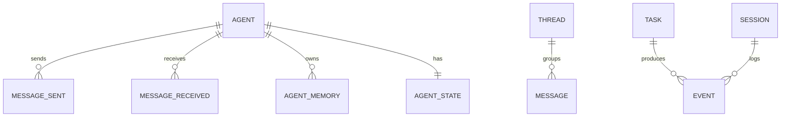

# AgentMesh — Data Model

All state is persisted in a single SQLite database at `~/.agentmesh/agentmesh.db` (WAL mode, foreign keys on). The schema is created by `agentmesh/db/database.py::init_db()`.

## 1. Entity Relationships

There is no `SKILL` or `SKILL_INVOCATION` entity — capability is expressed as messages, not tool calls.

## 2. messages (the message bus)

| Column | Type | Notes |
|---|---|---|
| id | TEXT PK | message UUID |
| thread_id | TEXT | groups a conversation |
| sender_id | TEXT | agent name or `human` |
| recipient_id | TEXT | agent name or `human` |
| message_type | TEXT | one of the `MessageType` values |
| body | TEXT | natural-language content |
| metadata_json | TEXT | JSON, defaults to `{}` |
| created_at | TEXT | ISO-8601 timestamp |
| read | INTEGER | 0 = unread, 1 = read |

This table **is** the message bus. Polling reads unread rows for a recipient; consuming flips `read` to 1.

## 3. agent_memory (isolated per agent)

| Column | Type | Notes |
|---|---|---|
| id | TEXT PK | memory entry UUID |
| agent_id | TEXT | owning agent |
| memory_type | TEXT | `short` or `long` (CHECK constrained) |
| content | TEXT | natural-language memory |
| created_at | TEXT | ISO-8601 timestamp |

Access control is enforced in code: `MemoryStore.read` raises `PermissionError` when the requesting agent is not the owner. There is deliberately no cross-agent read path — knowledge moves via `messages`.

## 4. agent_states

| Column | Type | Notes |
|---|---|---|
| agent_id | TEXT PK | one row per agent |
| state | TEXT | current `AgentState` |
| updated_at | TEXT | ISO-8601 timestamp |

States: `IDLE`, `READING`, `PLANNING`, `EXECUTING`, `REPORTING`, `WAITING`, `ESCALATING`. Transitions are validated in `runtime/state_machine.py`.

## 5. tasks

| Column | Type | Notes |
|---|---|---|
| id | TEXT PK | task UUID |
| description | TEXT | natural-language task |
| submitted_by | TEXT | defaults to `human` |
| status | TEXT | defaults to `pending` |
| created_at | TEXT | ISO-8601 timestamp |
| completed_at | TEXT | nullable |

## 6. events (observability log)

| Column | Type | Notes |
|---|---|---|
| id | TEXT PK | event UUID |
| session_id | TEXT | groups events in a run |
| event_type | TEXT | e.g. state change, message published |
| actor_id | TEXT | agent or `human` |
| payload_json | TEXT | JSON, defaults to `{}` |
| created_at | TEXT | ISO-8601 timestamp |

## 7. Storage Strategy

### MVP (today)
- Single SQLite file at `~/.agentmesh/agentmesh.db`, WAL mode.
- No external services required; the system runs fully offline with the `mock` backend.

### Future
- Postgres for multi-process / multi-host deployments.
- Redis for hot in-flight state.
- A vector store for semantic long-term memory recall.
